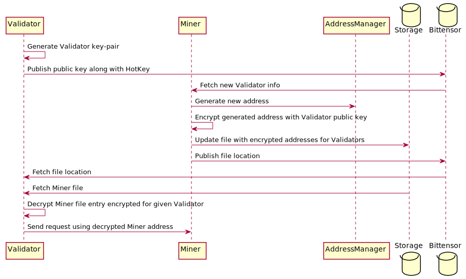

# BT DDoS Shield

`bt-ddos-shield` is a Python package designed for Bittensor subnet owners who want to protect miners from Distributed Denial-of-Service (DDoS) attacks and foster honest competition.
By enabling the Shield in the validator code, the subnet owner ensures that authenticated keys are published to the metagraph during validator software installation.
When miners run the shield via the provided Docker image, they fetch these trusted keys, so only traffic signed with these keys is allowed through.
This mechanism effectively blocks malicious requests from interfering with miner operations,
ensuring that miners compete on performance and quality rather than using disruptive tactics.

In addition to promoting fair competition, `bt-ddos-shield` leverages encryption to secure communication between miners and validators.
This decentralized approach keeps sensitive connection details—such as IP addresses and ports—hidden from malicious actors.
By replacing costly, traditional DDoS protection methods like WAF and Cloudflare,
`bt-ddos-shield` offers a scalable and cost-effective solution for subnets handling large volumes of data.

## Project Goals

The goal of this project is to implement a distributed and decentralized system that:
- Protects miner and validator IP addresses from exposure, preventing potential DDoS attacks.
- Removes the need for on-chain storage of unencrypted IP addresses and ports, eliminating an obvious attack surface.
- Uses encrypted messages between miners and validators to securely exchange connection information (connection address).
- Provides a scalable, decentralized alternative to traditional DDoS protection methods while maintaining performance and minimizing attack vectors.

## Features

1. **Encryption-Based Communication**:
   - Uses ECIES (Elliptic Curve Integrated Encryption Scheme) to encrypt communication between miners and validators.
   - The encrypted data includes connection details for validator (domain and port).

2. **Decentralized DDoS Mitigation**:
   - Removes the need for centralized DDoS protection services by distributing connection information securely across nodes.
   - Prevents IP address exposure by sharing encrypted connection data through a decentralized network of subtensors.

3. **Secure Message Exchange**:
   - Validators can request the connection information of miners from the subtensor network. This information is validated and
     decrypted locally using the validator's private key.


## Basic Communication Flow

<!--
@startuml ./assets/diagrams/CommunicationFlow
participant Validator
participant Miner
participant AddressManager
database Storage
database Bittensor
Validator -> Validator: Generate Validator key-pair
Validator -> Bittensor: Publish public key (via certificate field)
Bittensor -> Miner: Discover new Validator and fetch public key
Miner -> AddressManager: Generate new address
Miner -> Miner: Encrypt generated address with Validator public key
Miner -> Storage: Update file with encrypted addresses for Validators
Miner -> Bittensor: Publish file location
Bittensor -> Validator: Fetch file location
Storage -> Validator: Fetch Miner file
Validator -> Validator: Decrypt Miner file entry encrypted for given Validator
Validator -> Miner: Send request using decrypted Miner address
@enduml
-->




## Running Shield on server (Miner) side

### Disclaimers

* As for now Shield can only be used for hiding AWS EC2 server and uses AWS ELB and WAF to handle communication.
* As autohiding is not yet implemented, after starting Shield user needs to manually block traffic from all sources except
Shield's load balancer (ELB created by Shield during first run). This can be done using some firewall (like UFW) locally on
server or by configuring security groups in AWS via AWS panel (EC2 instance security groups should allow traffic only from ELB).

### Prerequisites

* Route53 hosted zone needs to be created and configured. Some external domain owned by user is needed for it. Domain ID
should be provided in `.env` file.
* S3 bucket with public access is needed for storing manifest file with encrypted addresses. Bucket name should be provided
in `.env` file.
* Miner's server needs to respond to ELB health checks. This can be done by configuring server to respond with 200 status
to `GET /` request on server's traffic port.

### Running Shield Docker image

TODO: Finish this section

Shield is prepared to run as Docker image. User should download the image from Docker Hub.

To run Shield, user needs to create `.env` file first. Here is template for it:
```
# Shielded server details (only EC2 instance now)

# Either AWS_MINER_INSTANCE_ID or AWS_MINER_INSTANCE_IP (private IP of EC2 server) should be used
AWS_MINER_INSTANCE_ID=
# AWS_MINER_INSTANCE_IP=

# Port where shield should redirect traffic
MINER_INSTANCE_PORT=


# AWS credentials

AWS_ACCESS_KEY_ID=
AWS_SECRET_ACCESS_KEY=
AWS_REGION_NAME=eu-north-1
AWS_S3_BUCKET_NAME=
AWS_ROUTE53_HOSTED_ZONE_ID=


# Bittensor credentials

SUBTENSOR__NETWORK=
NETUID=


# Wallet location

# WALLET__PATH=
WALLET__NAME=
WALLET__HOTKEY=
```

### Banning validators

To ban malicious validator, user can run Shield (first stop current process with Ctrl-C) with `ban` command passing Hotkey
as param:
```bash
TODO_DOCKER ban <HOTKEY>
```
This will remove given validator and update manifest file. Then Shield will be running the same as running it without ban option.
Banned validator will be saved to local database and will not be included in manifest file until it is unbanned. To unban validator
use `unban` command.

### Shield workflow

1. After starting Shield for the first time, it will create an ELB and WAF in AWS (along with other needed objects).
It can take few minutes for AWS to create these objects. There will be logs in console informing about the progress.
When Shield is run next time, it will use already created objects - info about them is stored in local database.
2. When initialization is done, validators list is retrieved from Bittensor and Shield creates domain address for each
validator, which uploaded their public key to Bittensor (using Shield on their side).
3. These addresses are aggregated into manifest file, encrypted and uploaded to S3 bucket. Then info about manifest file
is published to Bittensor.
4. When Shield is running, it cyclically checks if there are any new validators or if any validator's public key has
changed. If so, it updates manifest file and uploads it to S3 bucket. Stopping Shield process (container) with Ctrl-C only
stops these cyclic checks - Shield will be still working as AWS objects are left.
5. If user wants to disable Shield completely and clean objects created by Shield, run Shield image with `clean` command:
```bash
TODO_DOCKER clean
```


## Using Shield on client (Validator) side

### Usage instructions:

To make miner publish encrypted address for validator, validator needs to use `Shield` library on their side also. First install
`Shield` library from pypi repository or add it as dependency to your project. Then change validator's code to use `ShieldMetagraph`
class instead of `Metagraph` from `bittensor` lib in every place where you are creating a `Metagraph` instance. This allows easy
drop-in replacement -- no other changes are needed, only some new params are added to ShieldMetagraph. Required params are
(others are not important and can have default values):
 * `certificate_path` - Path to PEM file with validator's ECDSA key. If the file does not exist, during running `ShieldMetagraph`
    constructor new ECDSA key-pair will be generated, saved to this file and uploaded to Subtensor using neuron `certificate`
    field. Upload to Subtensor is done using `serve_extrinsic` method from bittensor library - there is no better way to do
    it as for now - but it will not overwrite any data already set on chain.
 * `wallet` - Wallet object needed to set certificate field.

### Implementation details:

During `sync` metagraph operation `ShieldMetagraph` class is trying to fetch manifest files for all miners in subnet. For those,
who have manifest file uploaded, `ShieldMetagraph` fetches the file and decrypts prepared address using validator's private key.
If manifest file or entry for given validator is not found, then nothing happens for given miner. If it is found and
successfully decrypted, then `ip` and `port` fields are updated in metagraph axon info. Please note, that after this update
`ip` field will contain domain address, not IP address. Connecting to miner should work without problems as before, but
when there will be some problems with this, user can disable `replace_ip_address_for_axon` option in `ShieldMetagraph` - there
is `options` param in `ShieldMetagraph` constructor.


## Running the Shield locally:

Run `setup-dev.sh` script to install the required dependencies and set up the development environment.
Then create a `.env` file filling template file `envs/.env.template`. Stub should be made by `setup-dev.sh` script.
Then activate venv with `source .venv/bin/activate` and run the following command to run the Shield:
```bash
bin/run_shield.sh
```
Commands can be passed as arguments to `run_shield.sh` script. Example:
```bash
bin/run_shield.sh clean
```


## Working with the Shield Docker image

### Creating Docker image

To create a Docker image, run the following command:
```bash
cd docker && ./build_image.sh
```

### Running Docker image locally

To run created Docker image, first create a `docker/.env` file filling template file `envs/.env.template`.
Then run the following command:
```bash
cd docker && ./run_image.sh
```
Commands can be passed as arguments to `run_image.sh` script. Example:
```bash
./run_image.sh clean
```


## Contribution Guidelines

To contribute to the `bt-ddos-shield` package, follow the steps below. Contact with us should be done via GitHub.

### 1. Clone the Repository:

```bash
git clone https://github.com/bactensor/bt-ddos-shield.git
cd bt-ddos-shield
```

### 2. Install Dependencies:

Run `setup-dev.sh` script to install the required dependencies and set up the development environment.

### 3. Run Tests:

First create a `.env.test` file filling template file `envs/.env.test.template`. Stub should be made by `setup-dev.sh` script.
Then activate venv with source .venv/bin/activate and run the following command to execute tests:
```bash
PYTHONPATH=./ pytest
```

### 4. Make changes:

Make changes to the codebase and ensure that the tests pass. Then send a pull request with the changes.

### 5. TODO list:

Improvements we will appreciate (and help you with):
* Allowing the use of Shield with cloud providers other than AWS. One must implement `AbstractAddressManager` (like `AwsAddressManager` does).

## License

See the [LICENSE](./LICENSE) file for more details.
